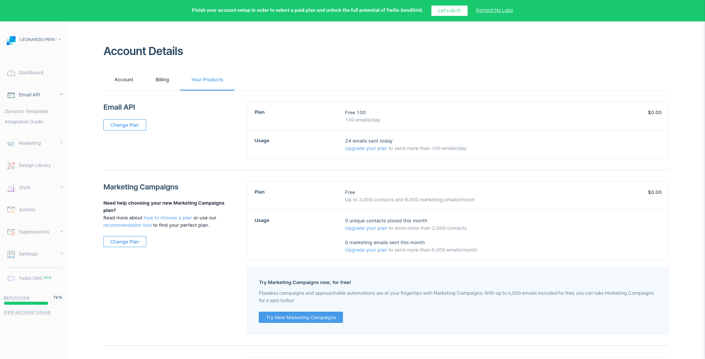
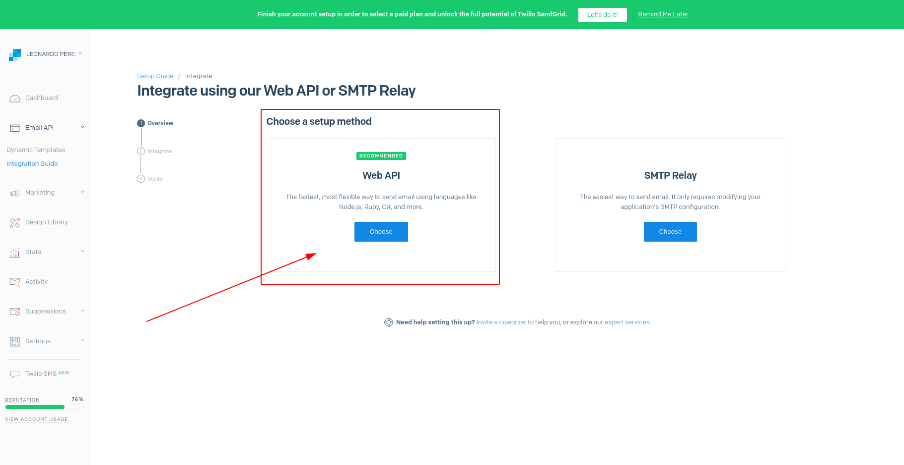
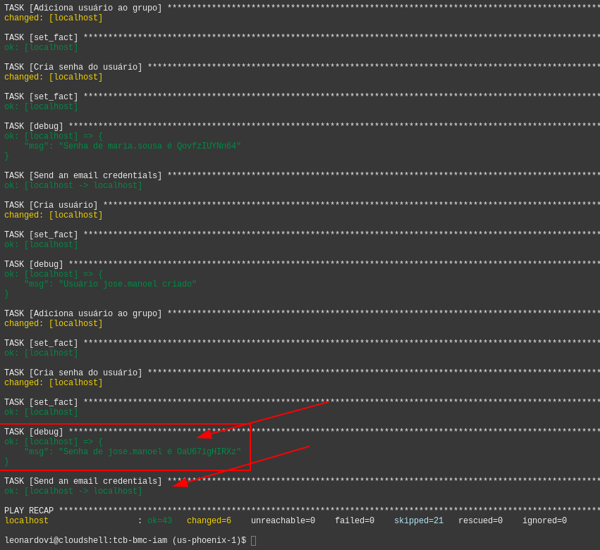
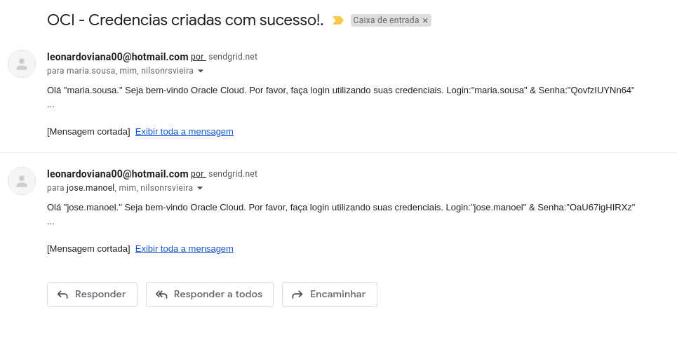

## DESCRIÇÃO DESAFIO ANSIBLECRY

## Descrição 
Durante o Projeto Cloud Implementação IAM, ao executar os playbooks para criação dosrecursos IAM de forma automatizada na Oracle Cloud Infrastructure, você perceberá que ocódigo, propositalmente, fará a criação dos usuários, grupos, irá adicionar o usuário no seurespectivo grupo, criará a senha do usuário e vai printar a senha na console, para que você,por exemplo, compartilhe a senha pro usuário.Só que pensa no seguinte cenário. Imagina que você tivesse que fazer isso para 200 usuários.Será que para cada 1 desses 200 usuários, você enviaria o usuário e senha de forma manual?Seria essa a melhor forma de concluir essa atividade?A resposta, com toda certeza, é não. Não é dessa forma que você, Bootcamper, avançaria.Curiosidade

## Ferramentas e Tecnologias

- OCI
- Ansible
- sendGrid
- Oracle Cloud Services
   - Identity & Security
      - Identity
         - Users
         - Groups
      - Policies
      - Compartiments
   - Oracle Cloud Shell

## Fases do Projeto

1. Criar conta na OCI
2. Criar compartimentos manualmente
3. Preparar variáveis e criar playbooks ansible
4. Executa todos os playbooks necessários do Oracle Cloud Shell para criar automação de usuários
5. Configure a API externa e integre a API de email da web sendGrid

## Compartimentos

- RecursosRedes
- RecursosCompute
- RecursosDB

## Preparação das variáveis

- Atualizar as linhas abaixo, inserindo a OCID da tenancy e dos compartments: RecursosRedes, RecursosCompute e RecursosDB:

```console
export PARENT_COMPARTMENT_OCID=<inserir-ocid>
export COMPUTE_COMPARTMENT_OCID=<inserir-ocid>
export REDES_COMPARTMENT_OCID=<inserir-ocid>
export DB_COMPARTMENT_OCID=<inserir-ocid>
export SENDGRID_API_KEY=<inserir-apikey-sendgrid>
```

## Playbooks

- Fazer download do arquivo tcb-bmc-iam.yaml

```console
wget https://objectstorage.us-ashburn-1.oraclecloud.com/p/JwXwD1vHS3yOm79o1LQUctIXMw9ZryXR5BQ9o6fLbv2zhpyDvIVkGiw6tQItN3Vn/n/idqfa2z2mift/b/bootcamp-oci/o/oci-f-handson-modulo-iam.zip
```
```console
unzip oci-f-handson-modulo-iam.zip
```
## Execução dos playbooks
```console
ansible-playbook tcb-bmc-iam-cria-grupos-e-politicas.yaml
ansible-playbook tcb-bmc-iam-cria-usuarios-cloud-admin.yaml
ansible-playbook tcb-bmc-iam-cria-usuarios-dba-admin.yaml
ansible-playbook tcb-bmc-iam-cria-usuarios-redes-admin.yaml
ansible-playbook tcb-bmc-iam-cria-usuarios-compute-admin.yaml
ansible-playbook tcb-bmc-iam-cria-usuarios-operadores.yaml
```

## Desafio AnsibleCry

1. Integração de API de e-mail externo : API de e-mail sendGrid
   - Criar uma conta com sendGrid
   - Criar uma API de e-mail
   - Integre essa API sendGrid ao Ansible Plabook

- Este projeto demonstra uma experiência de 100% de implantação e criação de usuários do IAM, grupos,
Políticas e Compartimentos dentro da OCI (Oracle Cloud) de forma totalmente automatizada, e também
integrando uma API de e-mail externa (sendGrid) através da qual o e-mail automatizado pode ser enviado para o
usuários após o processo de criação do usuário.


- Conta `sendGrid`

<p align="center">
  
</p>

- API de e-mail
<p align="center">
  
</p>

- Integração da API sendGrid ao Ansible

```console
- name: Send created credentials by email
  community.general.sendgrid:  
    api_key: "{{ sengrid_api_key }}"
    from_address: "leonardoviana00@hotmail.com"
    to_addresses:
      - "{{ item }}{{ dominio }}"
      - leonardoviana00@gmail.com 
    subject: "OCI - Credencias criadas com sucesso!." 
    body: 'Olá "{{ item }}."
      Seja bem-vindo Oracle Cloud.
      Por favor, faça login utilizando suas credenciais. Login:"{{ item }}" & Senha:"{{ user_password }}"'
  delegate_to: localhost 
  when: criacaousuario.changed
```

- OBS: Coloquei meu email em `to_address` para me certificar que os emails estavão sendo enviados, pois o domínio das contas criadas são ficticios.

<p align="center">
  
</p>

- Email

<p align="center">
  
</p>